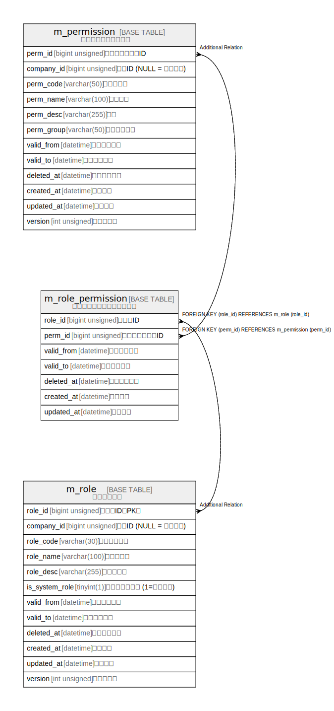

# 認可関連 ViewPoint

## 概要

認可関連のテーブルをまとめた ViewPoint

## テーブル一覧

| # | 名前                                        | カラム一覧      | コメント                       | タイプ        |
| - | ----------------------------------------- | ---------- | -------------------------- | ---------- |
| 1 | [m_permission](m_permission.md)           | 12         | パーミッションマスタ                 | BASE TABLE |
| 2 | [m_role](m_role.md)                       | 12         | ロールマスタ                     | BASE TABLE |
| 3 | [m_role_permission](m_role_permission.md) | 7          | ロールパーミッションマスタ              | BASE TABLE |

## ER図

---

> Generated by [tbls](https://github.com/k1LoW/tbls)
